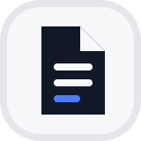

<p align="center">
  
</p>

# PaperAI

English | [中文](README.zh.md)

<p align="center"><strong>A local-first AI workspace for Word-native academic writing.</strong></p>

<p align="center">Write with Codex, Claude, or DeepSeek Harness. Keep every revision recoverable. Deliver against the required template.</p>

<p align="center">
  <a href="LICENSE"></a>
  
  
  
</p>

PaperAI treats a Working DOCX—not Markdown or generated HTML—as the editable authority for an academic document. Human edits and local Agents use the same versioned document services, while confirmed institutional templates define the checks required for formal delivery.

The product is built on a pinned [DeepSeek Harness](https://github.com/deepseek-ai/deepseek-harness) foundation and integrates [OfficeCLI](https://github.com/iOfficeAI/OfficeCLI) for Word inspection, preview, and structured mutation.

## What PaperAI provides

| Capability | What it means |
|---|---|
| Word-native editing | Import `.docx`, preserve the original source, and edit a separate authoritative Working DOCX. |
| Template-aware delivery | Use the built-in HIT master's thesis pack or upload a custom Word template, inspect the parsed requirements, and confirm them before use. |
| Multiple Agent routes | Use the built-in DeepSeek Harness Agent or local Codex and Claude adapters through ACP. |
| Human and Agent parity | The workbench and authenticated PaperAI MCP tools call the same document, template, version, restore, and export services. |
| Recoverable history | Every successful human or Agent document change advances a version with actor, client, provider, and model provenance. |
| Formal export checks | Drafts remain available; formal delivery must pass the attached confirmed template requirements, and templateless documents export freely. |
| Local-first operation | Projects, source files, Working documents, templates, version objects, and application state remain on the local machine. |

## Document workflow

1. **Create or adopt a workspace.** PaperAI initializes the project layout and Git repository idempotently.
2. **Import a Word document.** `.docx` imports directly; Windows can normalize legacy `.doc` files through read-only Microsoft Word automation.
3. **Associate a template.** Choose the built-in HIT pack or upload a custom template, then review and confirm its parsed requirements.
4. **Write with a human or Agent.** Edit semantic sections in the workbench or let Codex, Claude, or DeepSeek Harness use the PaperAI tools.
5. **Review and recover.** Inspect provenance, compare revisions, resolve concurrent edits, or restore an earlier document version.
6. **Export deliberately.** Produce a draft at any time or run the template checks before formal delivery.

Original Word files and template uploads are immutable inputs. OfficeCLI renders previews and applies structured changes only to derived Working copies.

<a id="run-from-source"></a>

## Run from source

### Requirements

- Node.js `^22.19.0` or `>=24.0.0`
- pnpm `11.7.0`
- Git
- A local ACP provider when using Codex or Claude
- Microsoft Word Desktop only when normalizing legacy `.doc` files on Windows

### Start PaperAI

```sh
git clone https://github.com/cacdcaecawae/PaperAI.git
cd PaperAI
pnpm install --frozen-lockfile
pnpm run build
pnpm paperai
```

Configure provider API keys, endpoints, model selection, and permission mode in the inherited DSH settings. Unavailable local dependencies appear as explicit degraded states instead of inactive controls.

## Architecture

| Layer | Responsibility |
|---|---|
| DSH foundation | Plugin runtime, Agent loop, sessions, settings, permissions, storage, and shared client components. |
| PaperAI workbench | Workspace, conversation, document, template, history, and delivery experiences. |
| PaperAI domain services | Projects, documents, templates, commits, conflicts, gates, exports, provenance, and authenticated MCP operations. |
| ACP integration | Native local Codex and Claude sessions with provider-owned model choices and permission modes. |
| OfficeCLI integration | Word structure inspection, HTML preview generation, structured mutation, and document validation. |

Start with the [PaperAI product profile ADR](.agents/notes/implemented/architecture/2026-08-28-paperai-product-profile.md), then read the [architecture guide](docs/architecture.md) before changing packages. Contributor setup lives in [docs/development.md](docs/development.md), and repository-wide Agent instructions live in [AGENTS.md](AGENTS.md).

## Security and privacy

- Agent permissions use the visible DSH permission controls; full access is an explicit user choice.
- The selected model provider may receive content included in Agent requests. PaperAI itself does not require a hosted document backend.
- Credentials belong in the local settings or environment and must never be committed.
- Source Word files and uploaded templates are preserved separately from mutable Working documents.
- Formal exports are checked against the confirmed template associated with the document.

## Project status

PaperAI is pre-release software distributed as source. User-facing workflows are functional, but public APIs and on-disk formats may change before the first tagged release. Back up important projects and review formal exports before submission.

## Contributing

Issues and pull requests are welcome. Read [CONTRIBUTING.md](CONTRIBUTING.md) for setup, testing, documentation, and review requirements.

## License and acknowledgements

PaperAI code and the retained DeepSeek Harness foundation are distributed under the [MIT License](LICENSE). DeepSeek Harness attribution and direct dependency licenses remain in [THIRD_PARTY_NOTICES.md](THIRD_PARTY_NOTICES.md).

Institutional template assets are not relicensed by PaperAI. The built-in HIT pack documents its terms in [ASSET_NOTICE.md](packages/paperai/template-pack-hit/ASSET_NOTICE.md).
