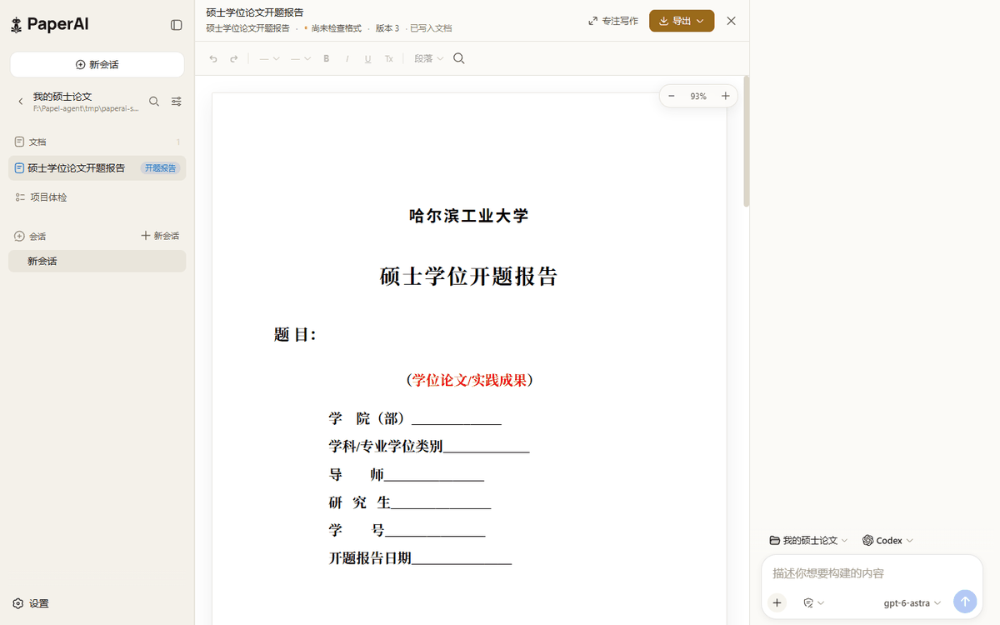
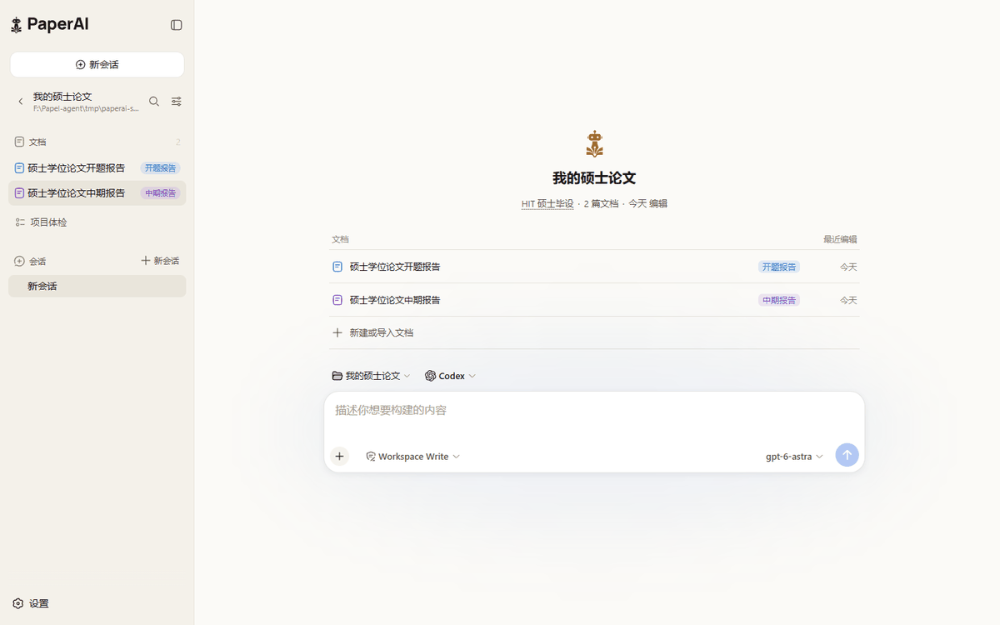
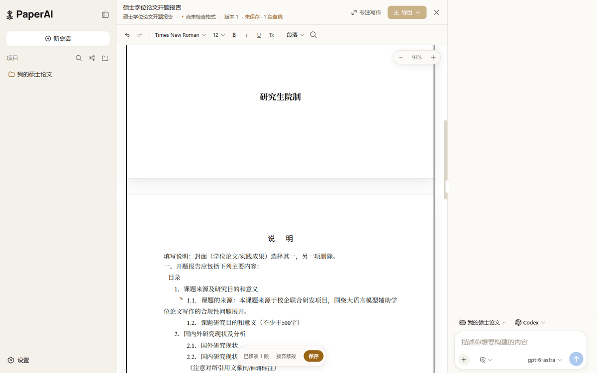
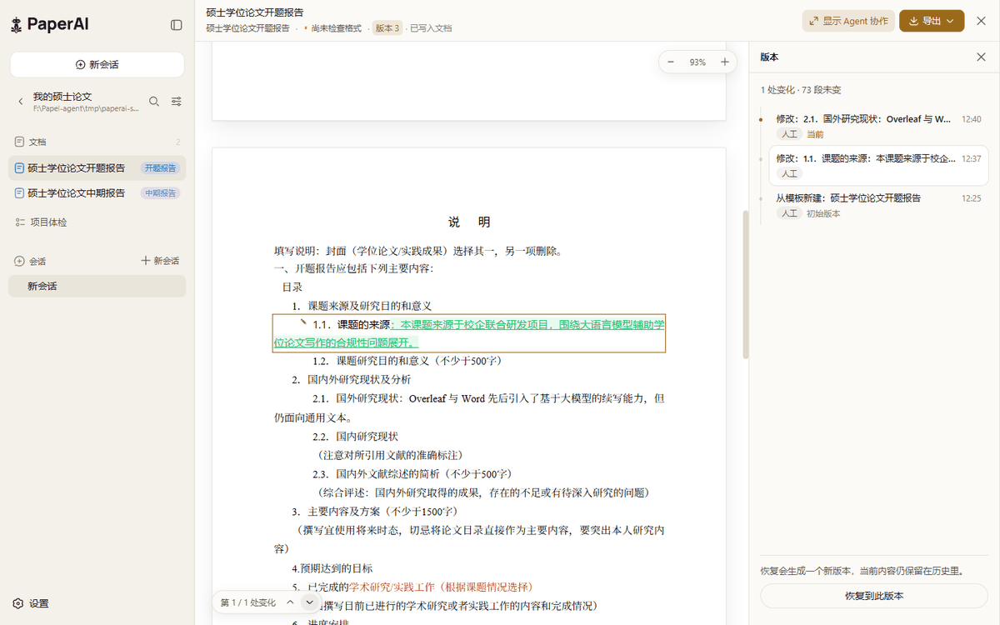

<p align="center">
  
</p>

# PaperAI

[English](README.md) | 中文

<p align="center"><strong>面向学术写作、本地优先的 Word 原生 AI 工作台。</strong></p>

<p align="center">像在 Word 里一样直接在页面上写。让 Codex、Claude 或 DeepSeek Harness 与你一起写。每次修改都可恢复，并严格按照指定模板完成交付。</p>

<p align="center">
  <a href="LICENSE"></a>
  
  
  
</p>

<p align="center">
  
</p>
<p align="center"><sub>页面就是工作区：直接在页面上输入，从一行菜单里排版，Agent 在同一份带版本的文档上工作。深色主题：<a href="docs/assets/workbench-dark.png">workbench-dark.png</a>。</sub></p>

PaperAI 把 Working DOCX 作为学术文档的可编辑权威，而不是把 Markdown 或生成的 HTML 当作真源。人工编辑和本地 agent（智能体）使用同一套带版本的文档服务，已确认的学校模板则定义正式交付必须满足的检查要求。

产品建立在固定版本的 [DeepSeek Harness](https://github.com/deepseek-ai/deepseek-harness) 底座上，并集成 [OfficeCLI](https://github.com/iOfficeAI/OfficeCLI) 完成 Word 检查、预览和结构化修改。

## 为什么选择 PaperAI

- **`.docx` 就是真源。** 没有格式转换的往返：浏览器直接渲染 Word 文件，你和 agent 的修改都落成 Word 的 run 和段落，Word 打开的就是保存下来的那份。
- **人和 agent 共用一份历史。** 每次保存都是一个版本，记录作者、客户端、提供方和模型。任意版本都可以直接在页面上比较，或作为新版本恢复。
- **模板守住交付。** 关联学校格式，查看解析出的要求，由格式检查决定正式导出能否放行。

## 界面

| 起始页 | 编辑中 | 版本比较 |
|---|---|---|
|  |  |  |
| 项目打开即见文档；模板集里的每种格式都从同一个菜单开始。 | 像在 Word 里一样直接在页面上输入；改过的段落停在一条浮条里，保存后成为一个版本。 | 点一版，它的改动就出现在页面上：删除划线，新增标记，逐处跳转。 |

## PaperAI 提供什么

| 能力 | 含义 |
|---|---|
| Word 原生编辑 | 导入 `.docx`、保留原始源文件，直接在渲染出的页面上输入、排版、拆分段落，改动写入独立且权威的 Working DOCX。 |
| 模板感知交付 | 使用内置的 HIT 硕士毕设模板包，或上传自定义 Word 模板；检查解析出的要求并确认后再使用。 |
| 多种 agent 路由 | 使用内置 DeepSeek Harness Agent，或通过 ACP（Agent Client Protocol）连接本地 Codex 和 Claude 适配器。 |
| 人工与 agent 能力一致 | 工作台和经过身份认证的 PaperAI MCP 工具调用同一套文档、模板、版本、恢复和导出服务。 |
| 可恢复历史 | 每次成功的人工或 agent 文档修改都会生成新版本，并记录操作者、客户端、提供方和模型来源。 |
| 正式导出检查 | 草稿可随时导出；正式交付必须满足已关联且已确认的模板要求，未关联模板的文档可自由导出。 |
| 本地优先运行 | 项目、源文件、Working 文档、模板、版本对象和应用状态均保留在本机。 |

## 文档工作流

1. **创建或接管工作区。** PaperAI 会幂等初始化项目目录和 Git 仓库。
2. **导入 Word 文档。** `.docx` 可直接导入；Windows 可通过只读 Microsoft Word 自动化规范化旧版 `.doc` 文件。
3. **关联模板。** 选择内置 HIT 模板包或上传自定义模板，然后检查并确认解析出的要求。
4. **由人工或 agent 写作。** 在工作台的页面上直接输入和排版，或让 Codex、Claude、DeepSeek Harness 使用 PaperAI 工具；选中文字后右键即可交给 agent。
5. **审阅与恢复。** 检查修改来源、在页面上比较版本、解决并发编辑，或恢复较早的文档版本。
6. **明确选择导出方式。** 随时生成草稿，或在正式交付前运行模板检查。

原始 Word 文件和上传的模板是不可变输入。OfficeCLI 只为派生的 Working 副本生成预览并应用结构化修改。

<a id="run-from-source"></a>

## 从源码运行

### 环境要求

- Node.js `^22.19.0` 或 `>=24.0.0`
- pnpm `11.7.0`
- Git
- 使用 Codex 或 Claude 时需要相应的本地 ACP 提供方
- 只有在 Windows 上规范化旧版 `.doc` 文件时才需要 Microsoft Word 桌面版

### 启动 PaperAI

```sh
git clone https://github.com/cacdcaecawae/PaperAI.git
cd PaperAI
pnpm install --frozen-lockfile
pnpm run build
pnpm paperai
```

提供方 API Key、接口地址、模型选择和权限模式均可在继承的 DSH 设置中配置。不可用的本地依赖会显示明确的降级状态，不会留下无效控件。

## 架构

| 层级 | 职责 |
|---|---|
| DSH 底座 | 插件运行时、agent loop（智能体循环）、会话、设置、权限、存储和共享客户端组件。 |
| PaperAI 工作台 | 工作区、对话、文档、模板、历史和交付体验。 |
| PaperAI 领域服务 | 项目、文档、模板、提交、冲突、门禁、导出、来源信息和经过身份认证的 MCP 操作。 |
| ACP 集成 | 使用提供方原生模型选择与权限模式的本地 Codex 和 Claude 会话。 |
| OfficeCLI 集成 | Word 结构检查、HTML 预览生成、结构化修改和文档验证。 |

请先阅读 [PaperAI 产品 Profile ADR](.agents/notes/implemented/architecture/2026-08-28-paperai-product-profile.zh.md)，再在修改包之前阅读[架构指南](docs/architecture.zh.md)。开发环境说明位于 [docs/development.zh.md](docs/development.zh.md)，仓库级 Agent 约定位于 [AGENTS.md](AGENTS.md)。

## 安全与隐私

- agent 权限使用可见的 DSH 权限控件；完全访问必须由用户明确选择。
- 选中的模型提供方可能收到 Agent 请求中包含的内容。PaperAI 本身不依赖托管式文档后端。
- 凭据应存放在本地设置或环境中，绝不能提交到仓库。
- Word 源文件和上传的模板与可修改的 Working 文档分开保存。
- 正式导出会按照文档所关联的已确认模板执行检查。

## 项目状态

PaperAI 是以源码分发的预发布软件。面向用户的工作流已经可用，但公开 API 和磁盘格式在首个正式标签发布前仍可能变化。请备份重要项目，并在提交前人工检查正式导出结果。

## 参与贡献

欢迎提交 Issue 和 PR（Pull Request）。环境配置、测试、文档和审查要求见 [CONTRIBUTING.zh.md](CONTRIBUTING.zh.md)。

## 许可证与致谢

PaperAI 代码与保留的 DeepSeek Harness 底座按 [MIT 许可证](LICENSE)分发。DeepSeek Harness 署名和直接依赖许可证保留在 [THIRD_PARTY_NOTICES.md](THIRD_PARTY_NOTICES.md)中。

学校模板资产不由 PaperAI 重新授权。内置 HIT 模板包在 [ASSET_NOTICE.md](packages/paperai/template-pack-hit/ASSET_NOTICE.md)中说明相关条款。
